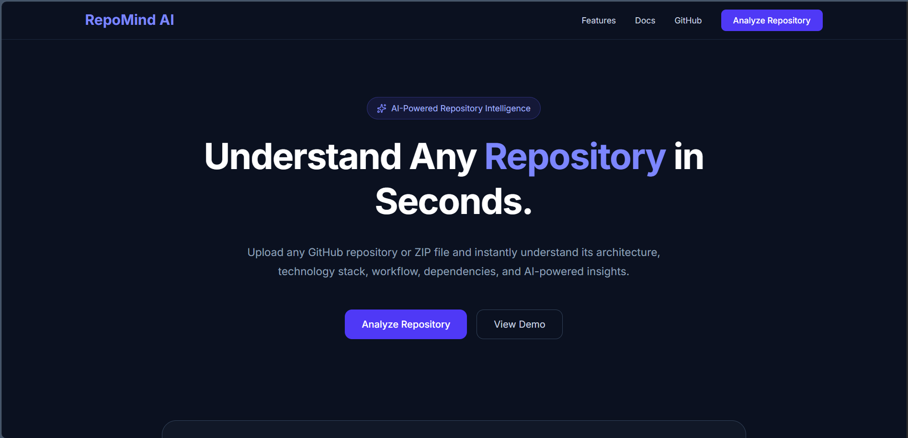
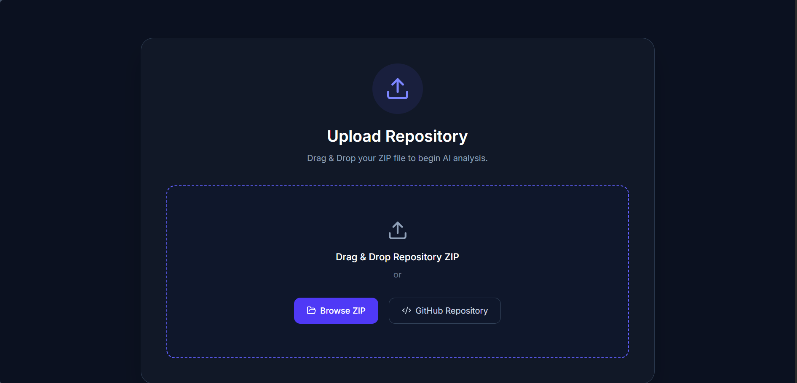
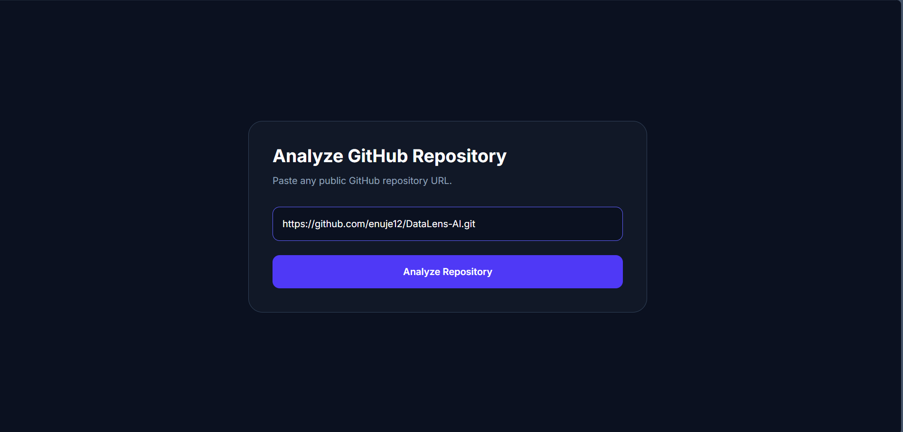
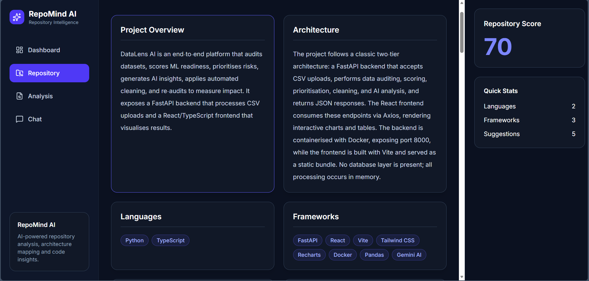
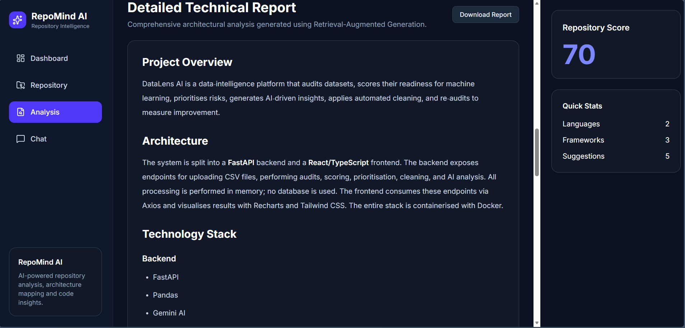
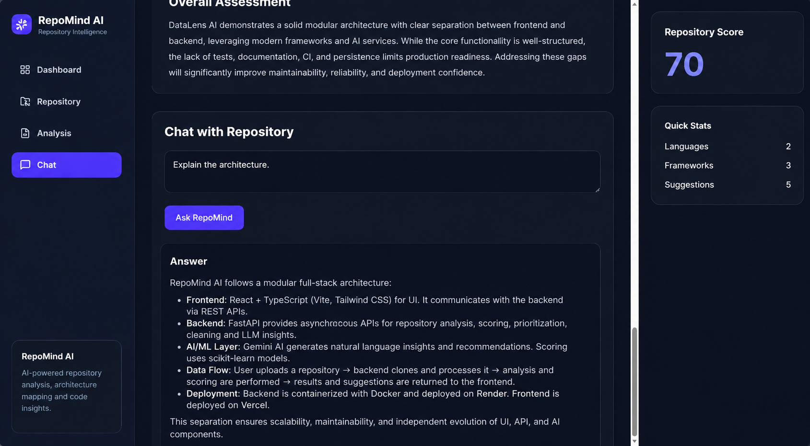

<div align="center">

# RepoMind

### AI-Powered Repository Intelligence Platform

Analyze any public GitHub repository or ZIP project using Large Language Models (LLMs) and Retrieval-Augmented Generation (RAG). RepoMind automatically understands repository architecture, identifies technologies, evaluates project quality, generates technical documentation, and enables intelligent conversations with your codebase.

<p>


</p>

### 🚀 Live Demo

**Frontend:** https://repo-mind-pi.vercel.app

</div>

---

## Overview

RepoMind is an AI-powered repository intelligence platform that helps developers quickly understand unfamiliar codebases.

Instead of manually exploring folders and source files, users can upload a ZIP project or provide a public GitHub repository URL. RepoMind automatically analyzes the repository, identifies its architecture, detects technologies, evaluates project quality, generates professional technical documentation, and provides an AI-powered repository chat assistant using Retrieval-Augmented Generation (RAG).

---

## Features

| Feature | Description |
|----------|-------------|
| GitHub Repository Analysis | Analyze any public GitHub repository using its URL. |
| ZIP Repository Upload | Upload local repositories as ZIP files for AI-powered analysis. |
| Repository Intelligence | Generate architecture, workflow, and implementation insights using LLMs. |
| Architecture Detection | Automatically identify the repository structure and design. |
| Technology Stack Detection | Detect programming languages, frameworks, libraries, and development tools. |
| Repository Scoring | Evaluate repository quality based on architecture and implementation. |
| Strength & Weakness Analysis | Highlight repository strengths and areas for improvement. |
| AI Recommendations | Generate actionable suggestions to improve maintainability and code quality. |
| Technical Report Generation | Produce a detailed Markdown-based technical report. |
| Repository Chat | Ask repository-specific questions using Retrieval-Augmented Generation (RAG). |
| Semantic Search | Retrieve relevant files using FAISS-based semantic search. |
| Resume Summary | Generate concise, resume-ready project descriptions automatically. |

---

## Home

<p align="center">

</p>

The landing page provides two ways to analyze repositories:

- Analyze GitHub Repository
- Upload ZIP Project

---

## Upload Repository

<p align="center">

</p>

Upload any local project as a ZIP file for instant AI-powered analysis.

---

## Analyze GitHub Repository

<p align="center">

</p>

Simply paste a public GitHub repository URL and RepoMind automatically clones, parses, and analyzes the project.

---

## Repository Dashboard

<p align="center">

</p>

The dashboard provides:

- Overall Repository Score
- Project Overview
- Languages Detected
- Frameworks & Libraries
- Architecture Summary
- Strengths
- Weaknesses
- Improvement Suggestions
- Resume Summary

---

## AI Technical Report

<p align="center">

</p>

RepoMind generates a professional GitHub-style technical report containing:

- Project Overview
- Architecture
- Technology Stack
- Repository Assessment
- Strengths
- Weaknesses
- Recommendations

---

## AI Repository Chat

<p align="center">

</p>

Using Retrieval-Augmented Generation (RAG), RepoMind enables users to ask repository-specific questions.

Example questions:

- Explain the project architecture.
- Which frameworks are used?
- How is the backend structured?
- How does the API work?
- What improvements would you recommend?
- Explain the authentication flow.

---

## System Architecture

```text
             GitHub Repository / ZIP Upload
                        │
                        ▼
                 FastAPI Backend
                        │
        ┌───────────────┼────────────────┐
        │               │                │
        ▼               ▼                ▼
 Repository Parser   File Reader   Repository Tree
                        │
                        ▼
             OpenRouter LLM Analysis
                        │
                        ▼
          Structured Repository Insights
                        │
                        ▼
                 React Dashboard
                        │
                        ▼
     FAISS + FastEmbed Semantic Indexing
                        │
                        ▼
          AI Repository Chat (RAG)
```

---

## Tech Stack

| Category | Technologies |
|----------|--------------|
| Frontend | React, TypeScript, Vite, Tailwind CSS, Axios |
| Backend | FastAPI, Python, GitPython, Uvicorn |
| AI | OpenRouter, GPT-OSS-20B |
| Retrieval | FAISS, FastEmbed |
| Deployment | Vercel, Render |

---

## Key Highlights

- End-to-End Full Stack AI Application
- LLM-Powered Repository Intelligence
- Retrieval-Augmented Generation (RAG)
- Semantic Search using FAISS
- GitHub Repository Analysis
- ZIP Repository Analysis
- AI-Powered Technical Documentation
- Production Deployment using Render & Vercel

---

## Future Improvements

- Private GitHub Repository Support
- Authentication & User Accounts
- Multi-Repository Comparison
- Pull Request Analysis
- Security Vulnerability Detection
- Repository Version Comparison
- Multi-Agent Repository Review

---

## Installation

```bash
git clone https://github.com/YOUR_USERNAME/RepoMind.git
```

### Backend

```bash
cd backend

pip install -r requirements.txt

uvicorn app.main:app --reload
```

### Frontend

```bash
cd frontend

npm install

npm run dev
```

---

## Author

**Anuja Rawat**

GitHub: https://github.com/enuje12

LinkedIn: https://www.linkedin.com/in/anujaraw
