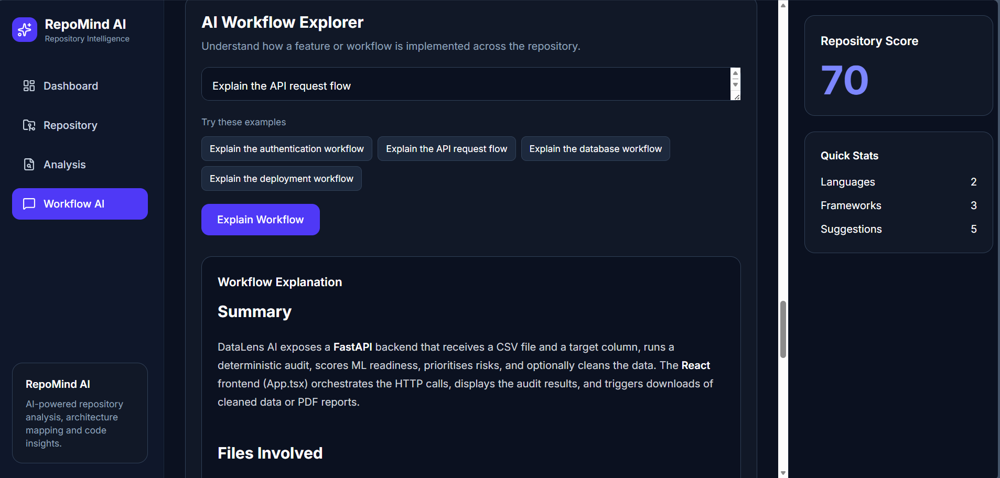
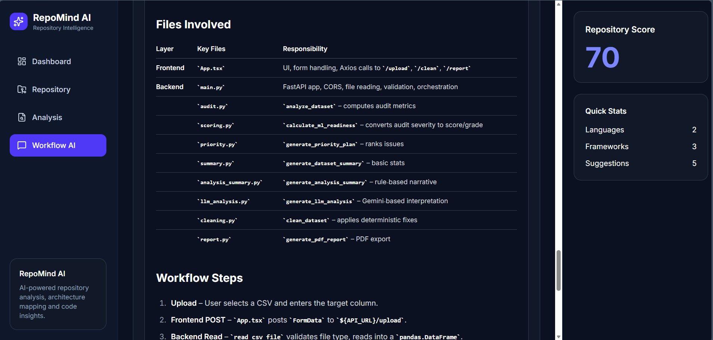

<div align="center">

# RepoMind

### AI-Powered Repository Intelligence Platform

Analyze any public GitHub repository or ZIP project using Large Language Models (LLMs) and Retrieval-Augmented Generation (RAG). RepoMind automatically analyzes the repository, identifies its architecture, detects technologies, evaluates project quality, generates professional technical documentation, and includes an AI Workflow Explorer that helps developers understand how features and workflows are implemented across unfamiliar codebases using Retrieval-Augmented Generation (RAG).

<p>


</p>

### 🚀 Live Demo

**Frontend:** https://repo-mind-pi.vercel.app

</div>

---

## Overview

RepoMind is an AI-powered repository intelligence platform that helps developers quickly understand unfamiliar codebases.

Instead of manually exploring folders and source files, users can upload a ZIP project or provide a public GitHub repository URL. RepoMind automatically analyzes the repository, identifies its architecture, detects technologies, evaluates project quality, generates professional technical documentation, and includes an AI Workflow Explorer that helps developers understand how features and workflows are implemented across unfamiliar codebases using Retrieval-Augmented Generation (RAG).

---

## Features

| Feature | Description |
|----------|-------------|
| GitHub Repository Analysis | Analyze any public GitHub repository using its URL. |
| ZIP Repository Upload | Upload local repositories as ZIP files for AI-powered analysis. |
| Repository Intelligence | Generate architecture, workflow, and implementation insights using LLMs. |
| Architecture Detection | Automatically identify the repository structure and design. |
| Technology Stack Detection | Detect programming languages, frameworks, libraries, and development tools. |
| Repository Scoring | Evaluate repository quality based on architecture and implementation. |
| Strength & Weakness Analysis | Highlight repository strengths and areas for improvement. |
| AI Recommendations | Generate actionable suggestions to improve maintainability and code quality. |
| Technical Report Generation | Produce a detailed Markdown-based technical report. |
| AI Workflow Explorer         | Explain repository workflows such as authentication, API flow, deployment, database interaction, and application startup using Retrieval-Augmented Generation (RAG). |
| Intelligent Repository Retrieval | Retrieve relevant repository files and generate implementation-aware explanations for developer workflows. |
| Resume Summary | Generate concise, resume-ready project descriptions automatically. |

---

## Home

<p align="center">

</p>

The landing page provides two ways to analyze repositories:

- Analyze GitHub Repository
- Upload ZIP Project

---

## Upload Repository

<p align="center">

</p>

Upload any local project as a ZIP file for instant AI-powered analysis.

---

## Analyze GitHub Repository

<p align="center">

</p>

Simply paste a public GitHub repository URL and RepoMind automatically clones, parses, and analyzes the project.

---

## Repository Dashboard

<p align="center">

</p>

The dashboard provides:

- Overall Repository Score
- Project Overview
- Languages Detected
- Frameworks & Libraries
- Architecture Summary
- Strengths
- Weaknesses
- Improvement Suggestions
- Resume Summary

---

## AI Technical Report

<p align="center">

</p>

RepoMind generates a professional GitHub-style technical report containing:

- Project Overview
- Architecture
- Technology Stack
- Repository Assessment
- Strengths
- Weaknesses
- Recommendations

---

## AI Workflow Explorer

Understanding an unfamiliar codebase often requires manually tracing dozens of files to determine how a feature is implemented. RepoMind's AI Workflow Explorer simplifies this process by allowing developers to ask implementation-focused questions about a repository.

Using Retrieval-Augmented Generation (RAG), the system retrieves the most relevant repository files and combines them with an LLM to generate a structured explanation of how a workflow is implemented.

Instead of searching through multiple files manually, developers can quickly understand how different components interact and where the core implementation resides.

### Example Questions

- Explain the authentication workflow.
- Explain how API requests are processed.
- Explain the database interaction flow.
- Explain the deployment process.
- Explain the application startup sequence.
- Explain how user registration is implemented.

### How it Works

1. The user submits a workflow-related question.
2. RepoMind retrieves the most relevant repository files and code snippets.
3. The retrieved context is provided to the LLM.
4. The AI generates a step-by-step explanation of the requested workflow, identifies the important files involved, and describes how they interact.

This enables developers to understand unfamiliar repositories significantly faster without manually tracing code across multiple directories.

<p align="center">
  
</p>

<p align="center">
  
</p>
---

## System Architecture

```text
             GitHub Repository / ZIP Upload
                        │
                        ▼
                 FastAPI Backend
                        │
        ┌───────────────┼────────────────┐
        │               │                │
        ▼               ▼                ▼
 Repository Parser   File Reader   Repository Tree
                        │
                        ▼
             OpenRouter LLM Analysis
                        │
                        ▼
          Structured Repository Insights
                        │
                        ▼
                 React Dashboard
                        │
                        ▼
         Intelligent Repository Retrieval
                        │
                        ▼
            AI Workflow Explorer (RAG)
```

---

## Tech Stack

| Category | Technologies |
|----------|--------------|
| Frontend | React, TypeScript, Vite, Tailwind CSS, Axios |
| Backend | FastAPI, Python, GitPython, Uvicorn |
| AI | OpenRouter, GPT-OSS-20B |
| Retrieval  | Intelligent Repository Retrieval, Context-Aware Workflow Analysis |
| Deployment | Vercel, Render |

---

## Key Highlights

- End-to-End Full Stack AI Application
- LLM-Powered Repository Intelligence
- Retrieval-Augmented Generation (RAG)
- AI Workflow Explorer for Repository Understanding
- Intelligent Repository Retrieval
- GitHub Repository Analysis
- ZIP Repository Analysis
- AI-Powered Technical Documentation
- Production Deployment using Render & Vercel

---

## Future Improvements

- Private GitHub Repository Support
- Authentication & User Accounts
- Multi-Repository Comparison
- Pull Request Analysis
- Security Vulnerability Detection
- Repository Version Comparison
- Multi-Agent Repository Review
- Semantic Vector Search using Embeddings
- Multi-Step Workflow Tracing

---

## Installation

```bash
git clone https://github.com/YOUR_USERNAME/RepoMind.git
```

### Backend

```bash
cd backend

pip install -r requirements.txt

uvicorn app.main:app --reload
```

### Frontend

```bash
cd frontend

npm install

npm run dev
```

---

## Author

**Anuja Rawat**

GitHub: https://github.com/enuje12

LinkedIn: https://www.linkedin.com/in/anujaraw
